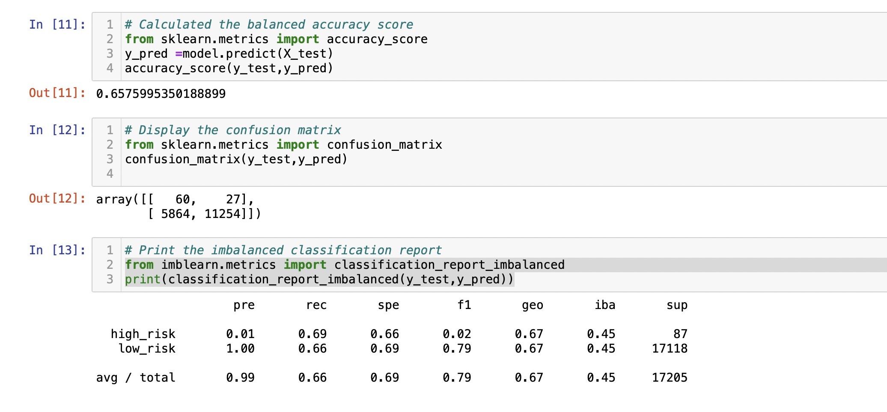
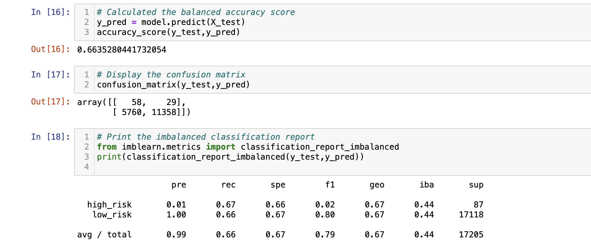
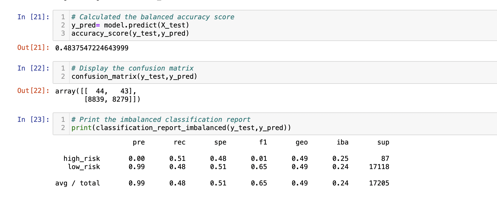
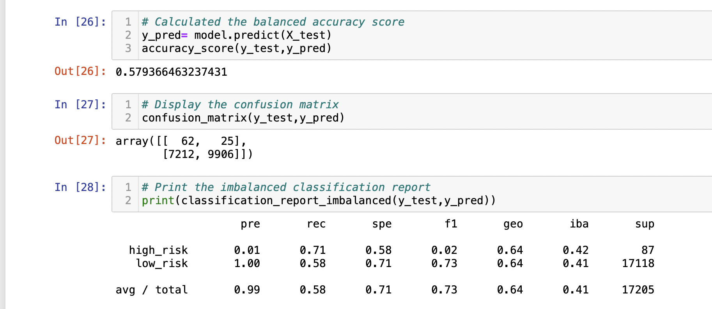
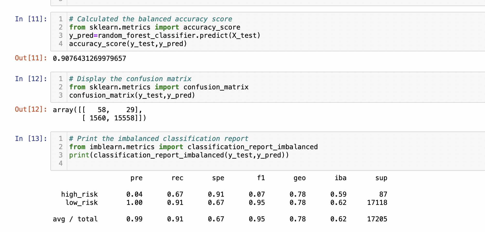
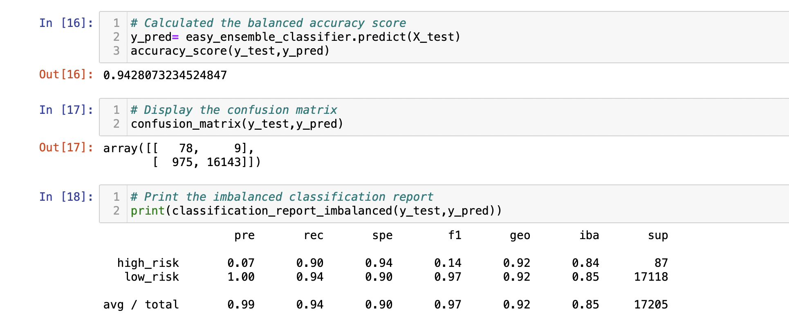

# Credit_Risk_Analysis

## Overview of the Analysis 

### Purpose 

The purpose of this project is to build and evaluate  machine learning models using Python to predict credit risk. 

Below are the procedures used for this analysis 

1. Oversample the data using RandomOverSampler and SMOTE algorithms

2. Undersample the data using the ClusterCentroids algorithms

3. Over and under smapling the data using SMOTEENN algorithms

4. Compare 2 machine learning modules using BalancedRandomforestClassifier and EasyEnsembleClassifier

## Results 

### RandomOverSampler model 

the balanced accuracy score is 65%

### SMOTE model 

the balanced accuracy is 66%

### ClusterCentroids model

the balanced accuracy is 48%

### SMOTEENN model

the balanced accuracy score is 57% 

### BalancedRandomForestClassifier model 

the balanced accuracy score is 90%

### EasyEnsembleClassifier model

the balanced accuracy score is 94%

## Summary 

All the models are used to perform the credit risk analysis and it determines weak precision in determining if a credit risk is high. Even though, EasyEnsembleClassifier model shows 94% prediction in detecting almost all the high risk credit but would not be ideal recommendation to use any of these models to predict credit risk anlysis.